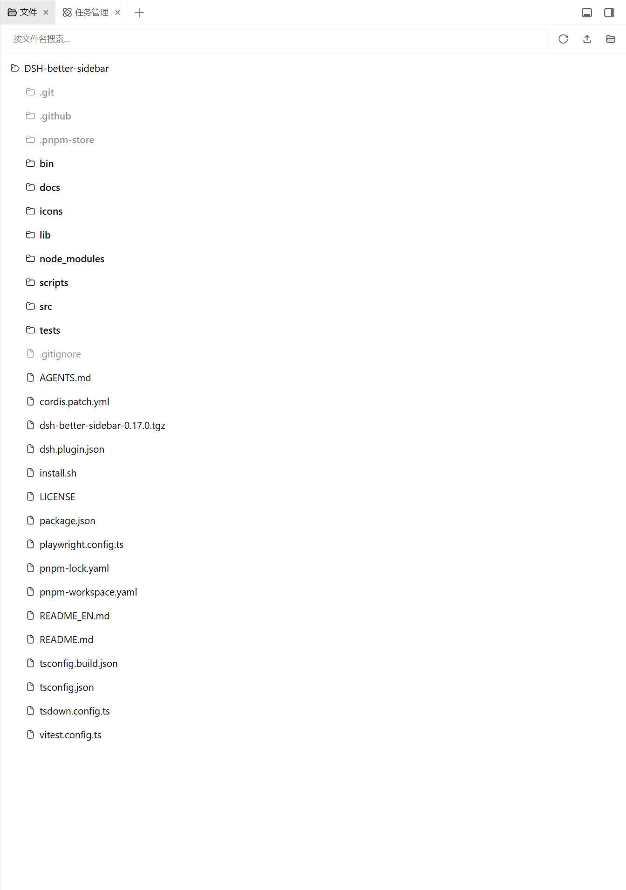
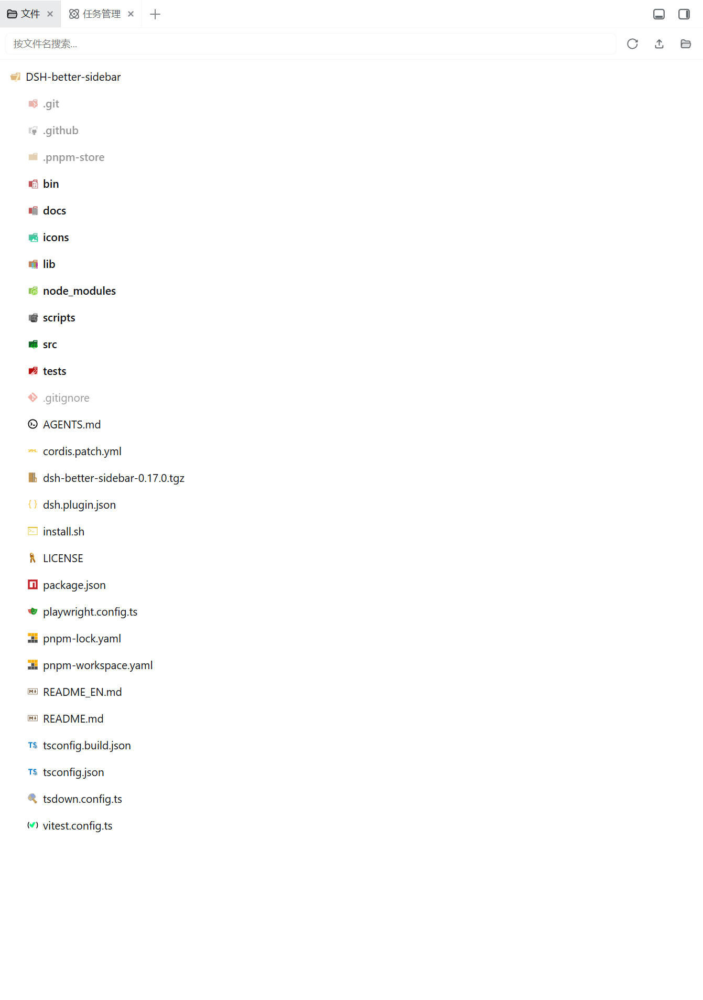

<div align="center">

# dsh-better-sidebar-icons

**VSCode 风格文件 / 文件夹图标主题**，为 DSH 侧边栏（better-sidebar）的文件树与编辑器 Tab 换上熟悉的开发环境图标。

纯 DOM 覆盖实现 · 不修改 better-sidebar 源码 · 安装 / 卸载零残留

[](LICENSE)
[](https://github.com/vscode-icons/vscode-icons)

</div>

---

## 📸 效果对比

<table>
<tr>
  <td align="center"><b>安装前</b><br><sub>better-sidebar 默认图标</sub></td>
  <td align="center"><b>安装后</b><br><sub>本插件 · VSCode 风格图标</sub></td>
</tr>
<tr>
  <td align="center"></td>
  <td align="center"></td>
</tr>
</table>

## ✨ 特性

- **文件树图标**：文件行按 basename / 扩展名匹配对应图标（`file_type_typescript.svg`、`file_type_json.svg` …），文件夹有开 / 合两种状态，根目录使用 root 图标
- **编辑器 Tab 图标**：Tab 栏同步使用文件类型图标，与文件树视觉一致
- **VSCode 同款匹配语义**：精确 basename → 大小写不敏感 basename → 扩展名逐段最长优先（先精确后宽松）
- **自动适配主题**：light / dark 颜色方案自动切换（跟随 `body[data-ds-dark-theme]`）
- **图标服务路由**：host 半提供 `/dsh-better-sidebar-icons/icons/<name>.svg`（白名单校验 + 浏览器信任栅栏 + ETag/304 缓存）
- **安全兜底**：未匹配到的文件回退默认图标，视觉上仍清晰可辨

## 📦 安装

```bash
dsh plugin --profile web add dsh-better-sidebar-icons
```

从源码安装：

```bash
git clone https://github.com/eg-bole/dsh-better-sidebar-icons.git
cd dsh-better-sidebar-icons
pnpm install
pnpm build
dsh plugin --profile web add link:"$PWD"
```

DSH 对 client 改动热加载；安装 / 升级插件版本后建议重启 `dsh web`。

## 🗑️ 卸载

```bash
dsh plugin --profile web remove dsh-better-sidebar-icons
```

卸载（或插件禁用 / 热重载）时，插件会把所有被替换的图标**恢复为宿主原样**，零残留。

## ⚙️ 工作原理

better-sidebar 的文件行渲染 react-icons 的 `VscFile` / `VscFolder` / `VscFolderOpened`，且核心不提供图标主题扩展点。本插件：

1. **client half**（浏览器）：监听 `[data-dsh-better-sidebar]` 挂载，MutationObserver 扫描文件树行（锚点：行的 `.explorerName` 标签 + `title=路径` 区分文件 / 文件夹，行首 svg 的 path 形状区分开 / 合），用匹配引擎解析图标，把行首 svg 换成 ``（指向插件路由）。React 重渲染后自动重应用；卸载时全部恢复。
2. **host half**（Node）：`/dsh-better-sidebar-icons/icons/<name>.svg` 路由，白名单 + 浏览器信任栅栏（同 /api 网关的 DNS-rebinding 防线）+ ETag/304。

## 🎯 匹配语义

- **文件**：精确 basename → 大小写不敏感 basename → 扩展名候选（`archive.tar.gz` → `gz`、`tar.gz`，**最长优先**，各先精确后宽松）→ 默认图标
- **文件夹**：精确 → 宽松，按开 / 合态分别匹配 `folderNames` / `folderNamesOpen`

## 🔄 重新生成图标

`icons/` 与 `src/client/icons-manifest.generated.ts` 是**提交产物**（构建自包含）。上游 vscode-icons 资产更新时才需要重新生成：

```bash
node scripts/gen-icons.mjs --vscode-icons <vscode-icons-checkout>
```

## 🛠️ 开发

```bash
pnpm install
pnpm typecheck   # tsc --noEmit
pnpm test        # vitest（匹配引擎 / 路由 / DOM 覆盖）
pnpm build       # tsdown（lib/index.js + lib/client.js）+ 声明
```

## 📄 许可

MIT。图标资产来自 [vscode-icons](https://github.com/vscode-icons/vscode-icons)（MIT），匹配语义遵循 VSCode better-sidebar-icons 引擎（MIT）。
